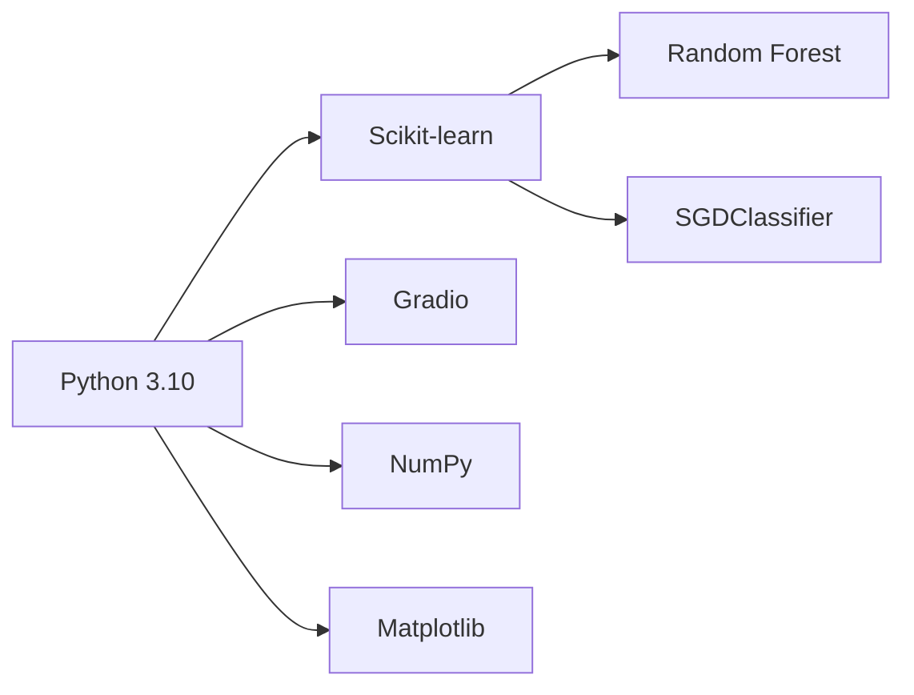

# 🚀 MNIST Digit Classifier with Dual-Model Architecture


<div align="center">
  
  <p><em>Classify handwritten digits with 96%+ accuracy</em></p>
</div>

## 🌟 Key Features

| Feature | Description |
|---------|-------------|
| 🎨 Interactive Canvas | Draw digits directly in the browser |
| 🤖 Dual Model System | Switch between Random Forest and SGDClassifier |
| ⚡ Real-time Prediction | Instant results with confidence scores |
| 📊 Model Metrics | Built-in performance visualization |
| 🖼️ Image Upload | Support for PNG/JPG digit images |

## 🛠️ Tech Stack


## 🚀 Quick Start

Get up and running with the MNIST Digit Classifier Gradio App in just a few steps.

### 🔧 Prerequisites

- Python 3.10+
- pip
- Git

### ⚙️ Setup & Run

```bash
# 1. Clone the repository
git clone https://github.com/ShehryarKhan123-ship-it/mnist-gradio-classifier.git
cd mnist-gradio-classifier

# 2. Create a virtual environment
python -m venv venv

# 3. Activate the virtual environment
source venv/bin/activate       # For Linux / macOS
# OR
venv\Scripts\activate          # For Windows

# 4. Install required dependencies
pip install -r requirements.txt

# 5. Launch the Gradio app
python app.py
```
## 📊 Model Performance

| Model          | Accuracy | Precision | Recall | Training Time |
|----------------|----------|-----------|--------|----------------|
| 🟩 Random Forest   | 96.2%   | 96.4%     | 96.1%  | 45s            |
| 🟦 SGDClassifier   | 92.8%   | 93.1%     | 92.5%  | 18s            |


## 💻 Usage Examples

Use the trained model in your own Python scripts for inference or integration into larger ML pipelines:

```python
# Load trained model
from joblib import load
model = load('models/random_forest.joblib')

# Preprocess input image (e.g., 28x28 grayscale flattened)
processed_image = preprocess(your_image_data)

# Make prediction
prediction = model.predict([processed_image])
print(f"Predicted: {prediction[0]}")

```
## 🧠 Model Training Overview

The models were trained using the **MNIST dataset** fetched from `sklearn.datasets.fetch_openml`. Each image was:

- Flattened from 28×28 to a 784-dimensional vector
- Normalized to scale pixel values between 0 and 1

### 🏗️ Models Used

- ✅ **Random Forest**  
  - 100 estimators  
  - Default Gini impurity criterion  

- ✅ **SGDClassifier**  
  - Hinge loss (SVM-like)  
  - L2 regularization  
  - Suitable for large-scale learning

### 📏 Evaluation Metrics

Both models were evaluated using:

- **Accuracy**
- **Precision**
- **Recall**
  
## 🖼️ Image Upload Instructions

When using the app:

- You can **draw your digit** using the Gradio canvas.
- Or **upload a PNG/JPG image** (28x28 grayscale works best).
- The image is preprocessed and passed to the selected model for prediction.

> 📝 Ensure the background is white and the digit is dark for best accuracy.

---

## 🔧 To Do

- [ ] Add CNN-based model (Keras/TensorFlow)
- [ ] Deploy on Hugging Face Spaces
- [ ] Add performance comparison chart
- [ ] Include training logs and model interpretability visualizations

---

## 🤝 How to Contribute

Contributions are welcome! Help make this project better by following these simple steps:

1. **Fork the repository**

2. **Create your feature branch**  
   ```bash
   git checkout -b feature/your-feature
   git commit -m "Add some amazing feature"
   git push origin feature/your-feature

## 📄 License
This project is licensed under the MIT License. See the LICENSE file for details.

##  Acknowledgements

- [Scikit-learn](https://scikit-learn.org/)
- [Gradio](https://gradio.app/)
- [OpenML MNIST Dataset](https://www.openml.org/d/554)
- [Matplotlib](https://matplotlib.org/)
- [NumPy](https://numpy.org/)

## 📬 Contact

**Author:** Shehryar Khan  
**Project Repository:** [MNIST Gradio Classifier](https://github.com/ShehryarKhan123-ship-it/mnist-gradio-classifier)


